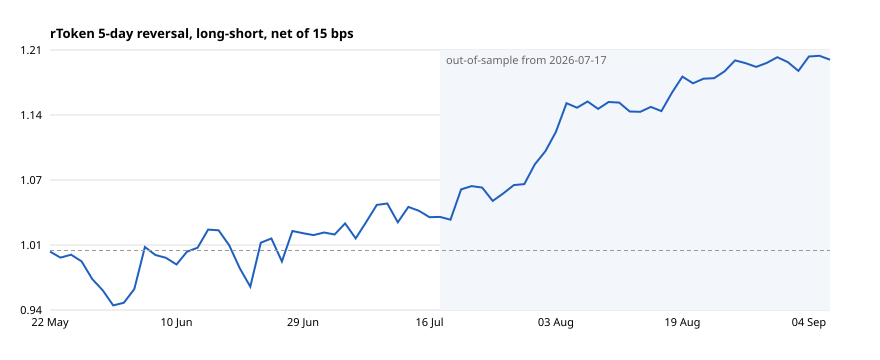

# rToken short-term reversal

**Bitget AI Hackathon S2 — Alpha Factory track, sub-theme: rToken factor strategies.**

A dollar-neutral, one-week reversal factor on Bitget's tokenized US stocks (rTokens), with fills
and capacity taken from the order book rather than from the reported volume. Pure Python, no
dependencies, fully reproducible from the committed data snapshot.

```bash
python scripts/run_backtest.py --grid      # results.json, daily_returns.csv, equity.svg, param_grid.json
python tests/test_backtest.py              # lookahead / cost / signal-capture checks
python scripts/liquidity_report.py         # live book snapshot + capacity (run during US cash hours)
```



## Results (net of 15 bps round-trip per rotated dollar)

| | sessions | Sharpe | Sortino | max DD | ann. return | win rate |
|---|---|---|---|---|---|---|
| **total** (22 May → 9 Sep 2026) | 75 | **2.89** ± 1.8 | 5.59 | −5.8 % | +63 % | 52 % |
| in-sample (22 May → 16 Jul) | 37 | 0.99 ± 2.6 | 1.76 | −5.8 % | +27 % | 43 % |
| out-of-sample (17 Jul → 9 Sep) | 38 | 6.47 ± 2.6 | 17.96 | −1.4 % | +98 % | 61 % |

Daily turnover 20 % of the book (one tranche of five). Rolling 30-session Sharpe
(`reports/rolling30_sharpe.csv`): min +0.51, median +5.26, **positive in 100 % of windows**.
No out-of-sample decay: OOS / IS Sharpe = 6.6 (the handbook flags < 0.5).

The `±` is the standard error of an annualised Sharpe on that many sessions (`sqrt(252/n)`). Read the
out-of-sample number as "positive and consistent", not as "6.5". Both halves are positive; the
maximum drawdown lives entirely in the in-sample half.

## Thesis

Recent one-week losers outperform recent one-week winners over the following week. This is the
classic short-term reversal of Jegadeesh (1990) and Lehmann (1990), driven by liquidity provision:
uninformed order flow pushes prices away from value and market makers are paid to carry them back.

rTokens are an unusually clean place for it. The venue is young (most names listed April 2026), the
on-venue book is thin (see below), and the participant base is crypto-native rather than equity
market makers — so the temporary price pressure that reversal harvests should be larger and slower
to correct than on the underlying US exchange.

## Method

| | |
|---|---|
| Universe | 60 rTokens with the highest reported 24h volume (`data/candles_1h.json`) |
| Session close | Close of the 19:00–20:00 UTC bar = the 16:00 ET print |
| Signal | Trailing 5-session return, ranked cross-sectionally |
| Book | Long bottom quintile, short top quintile; inverse-20d-vol weights; 50 / 50 dollar-neutral |
| Holding | 5 sessions, in 5 rolling tranches → 20 % of the book rotates each session |
| Eligibility | ≥ 10 sessions of trading history (seasoning) and ≥ 55 eligible names, else skip the session |
| Costs | 15 bps round-trip on the rotated slice (spreads observed in cash hours on the largest names were 3–8 bps; 15 leaves room for impact) |
| Lookahead | Tranche opened at session *i* uses closes ≤ *i* and earns the *i → i+1* return. `tests/` enforces it. |

## Robustness

**Parameter neighbourhood** (`reports/param_grid.json`, Sharpe total / IS / OOS). The effect lives at
lookback 3–5 and hold 3–5 sessions and fades by 10 — the decay profile you expect from a genuine
short-horizon reversal, not from a single tuned point:

| lookback \ hold | 3 | 5 | 10 |
|---|---|---|---|
| **3** | 2.07 / −1.25 / 4.88 | 3.56 / −0.58 / 8.26 | 0.95 / −0.61 / 3.56 |
| **5** | 3.66 / 0.27 / 7.54 | **2.89 / 0.99 / 6.47** | 1.88 / −0.24 / 4.93 |
| **10** | 0.71 / −1.02 / 2.74 | 1.22 / −1.17 / 4.21 | 0.62 / −1.60 / 2.92 |

The 5 / 5 cell was fixed on the rank-IC test (IC −0.097, t −2.6, negative in both halves) before
the portfolio backtest was built; it is the centre of the positive region, not the best cell.

**Concentration.** Five high-volatility names (RNBIS, RLITE, RCRWV, RSOXL, RWDC) contribute ~2/3 of
gross P&L in the equal-weight version. Inverse-vol weighting is there to cap that; without those five
the equal-weight Sharpe halves but stays positive.

**Why the in-sample half is weaker.** The universe was still filling in: 13 names on 24 Mar, 33 on
2 Apr, 47 on 14 Apr, 58 by early May, with aggregate volume a third of its later level. The 20-session
rolling Sharpe is −4.5 for mid-Apr → mid-May and positive in every window after. The seasoning rule
excludes listing weeks on principle (the standard IPO exclusion in factor research), not by inspection.

## What the data actually looks like — and why most backtests on this venue will be wrong

Three things we verified on the public API that the hackathon brief does not say:

1. **The venue trades 24/5, not 24/7.** Hourly bars show a fixed 49-hour gap every weekend
   (Fri 23:00 → Mon 00:00 UTC) and US holidays (73 h over Labor Day). Some overnight hours have no
   prints at all.
2. **Reported volume is the underlying US tape, not on-venue flow.** `RSPYUSDT` reports ~$28 B of 24h
   volume — essentially real SPY — while its live order book holds ~$0.5 M across 20 levels.
   `RSBUXUSDT` reports $620 M against an *empty* depth endpoint. Any backtest that filters or sizes on
   `usdtVolume` overstates capacity by four to five orders of magnitude.
3. **Overnight liquidity is nil.** Aggregate volume 00:00–08:00 UTC is < 1 % of the 14:00 UTC bar.
   Strategies "for the hours humans sleep" cannot be filled at the prices their backtests assume.

This strategy therefore trades only at the 16:00 ET close, rotates 20 % of the book per session, and
measures capacity from `scripts/liquidity_report.py`, which snapshots the real book. The volume field
is used for one thing only: ranking names to pick the universe.

## Tradability check (live book, 14 Sep 2026)

`scripts/liquidity_report.py` run at 13:58 UTC — 28 minutes into the US cash session — found **17 of the
60 names with no two-sided order book at all** (RJPM, RWMT, RJNJ, RCOST, RXOM, RGLD, RDIA, RSOXL …).
Median spread on the 43 live books: 7.1 bps, p90 17.6 bps. Median depth over 20 levels on the thinner
side: $54k, p10 $23k. Strategy capacity at 10 % participation of the thin tail: **~$280k**.

`scripts/tradability_check.py` re-runs the backtest without the 17 untradable names:

| | sessions | Sharpe | IS | OOS | max DD | rolling-30 min |
|---|---|---|---|---|---|---|
| all 60 names (figures above) | 75 | 2.89 | 0.99 | 6.47 | −5.8 % | +0.51 |
| **43 names with a live book** | 72 | **5.02** | **2.30** | 8.83 | −4.1 % | +2.61 |
| 43 names, 25 bps costs | 72 | 4.76 | 2.07 | 8.53 | −4.1 % | +2.41 |

The untradable names are mostly large-cap defensives and ETFs, where one-week reversal is weak; they
were diluting the signal. The result is not carried by them — it strengthens without them, and the
in-sample half improves the most. The headline figures above keep all 60 names because we have one
book snapshot, not a history of them; a proper tradability filter would need the book at every close.
Snapshots are committed under `data/orderbook_*.json`.

## Limitations

- 75 sessions is short. The IS / OOS asymmetry could be regime. We report it rather than smooth it.
- Shorting rTokens requires margin availability on Bitget; the long-only leg alone was not tested.
- Costs are a flat 15 bps. Real impact at size will be higher; the liquidity report puts a number on it.
- Data ends 9 Sep 2026. `scripts/fetch_data.py` refreshes the snapshot; the reported figures are
  from the committed one.

## Layout

```
rtoken/data.py        Bitget v2 endpoints, session-close extraction, venue facts
rtoken/strategy.py    signal, quantiles, inverse-vol weights, Params
rtoken/backtest.py    tranche engine, costs, IS/OOS split
rtoken/liquidity.py   book-depth capacity (the honest sizing)
rtoken/metrics.py     Sharpe, Sortino, drawdown, standard errors
scripts/              run_backtest, fetch_data, liquidity_report
data/                 candles_1h.json (60 names × ~135 days), instruments.json
reports/              generated: results.json, daily_returns.csv, equity.svg, param_grid.json
```
